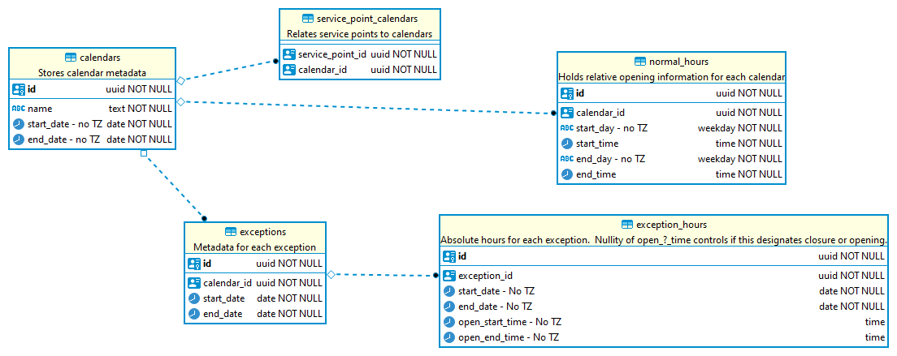

# Database Schema

A lot of thought and effort went into the database schema for this module. Quick response time is
essential due to the fundamental nature of this module, therefore, a strictly relational and
normalized schema is used.

## Timezone and Localization Support

For the database, all dates, times, and weekdays are timezone-agnostic. This is by design for a few
reasons:

- Simpler correspondence between the interface and the storage
- Elimination of potential complications with regards to all-day hours (and in particular, closure
  exceptions)
- Daylight savings/summer time will not affect the ranges
  - Without this, daylight savings would cause strange "jumps" halfway through each semester wherein
    the hours would be shifted before or after the clock change.

## Calendars to Service Points

Service points and calendars are many-to-many: a service point can have multiple calendars (although
none that overlap) and a calendar can be assigned to multiple service points.

## Exceptions

Exceptions are many-to-one to calendars: a calendar can have multiple exceptions but each exception
belongs to only one calendar.

### Exception Hours

Exception information is stored inside the `exception_hours` table -- the `start_date` and
`end_date` in the `exceptions` table is simply for indexing and performance reasons and should
contain the first and last day covered by its hours.

For the hours, the start/end date are self explanatory. If the exception overrides normal opening
hours, there will be a `open_start_time` and `open_end_time`. If it closes the library, these will
be `NULL`.

Exceptional opening hours will close the library for the rest of the calendar day (allowing an
exception to effectively reduce the hours).
